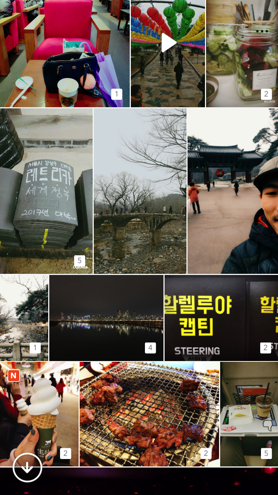
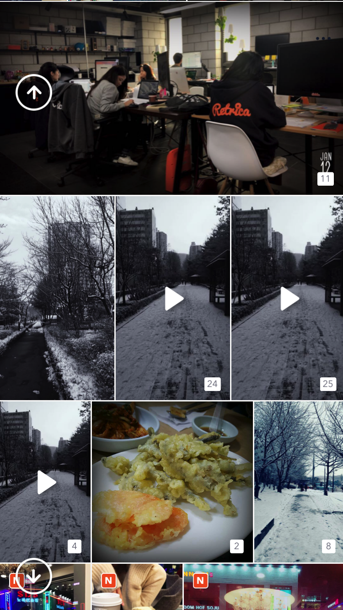

# ASIrregularCollectionUIKit

[](https://travis-ci.org/pisces/ASIrregularCollectionUIKit)
[](http://cocoapods.org/pods/ASIrregularCollectionUIKit)
[](http://cocoapods.org/pods/ASIrregularCollectionUIKit)
[](http://cocoapods.org/pods/ASIrregularCollectionUIKit)

## Example

To run the example project, clone the repo, and run `pod install` from the Example directory first.

## You can implement layout of collection view like this screenshot :)
<p valign="top">


</p>

### To implement collection view with the class ASIrregularCollectionViewController using UIKit for Texture
```Swift
class DemoViewController: IrregularCollectionViewController {
    override func viewDidLoad() {
        super.viewDidLoad()
        
        collectionViewLayout.columnSpacing = 1
        collectionViewLayout.numberOfColumns = 3
        collectionViewLayout.sectionInset = UIEdgeInsetsMake(1, 1, 1, 1)
    }
    override func numberOfSections(in collectionNode: ASCollectionNode) -> Int {
        return 1
    }
    override func collectionNode(_ collectionNode: ASCollectionNode, numberOfItemsInSection section: Int) -> Int {
        return contents.count
    }
    override func collectionNode(_ collectionNode: ASCollectionNode, nodeBlockForItemAt indexPath: IndexPath) -> ASCellNodeBlock {
        return {
            return SampleViewCellNode(content: self.contents[indexPath.item])
        }
    }
    override func collectionView(_ collectionView: UICollectionView, layout collectionViewLayout: UICollectionViewLayout, originalItemSizeAt indexPath: IndexPath) -> CGSize {
        let content = contents[indexPath.item]
        return CGSize(width: CGFloat(content.width), height: CGFloat(content.height))
    }
}
```

## Requirements

## Installation

ASIrregularCollectionUIKit is available through [CocoaPods](http://cocoapods.org). To install
it, simply add the following line to your Podfile:

```ruby
pod "ASIrregularCollectionUIKit"
```

## Author

Steve Kim, pisces@retrica.co

## License

ASIrregularCollectionUIKit is available under the MIT license. See the LICENSE file for more info.
